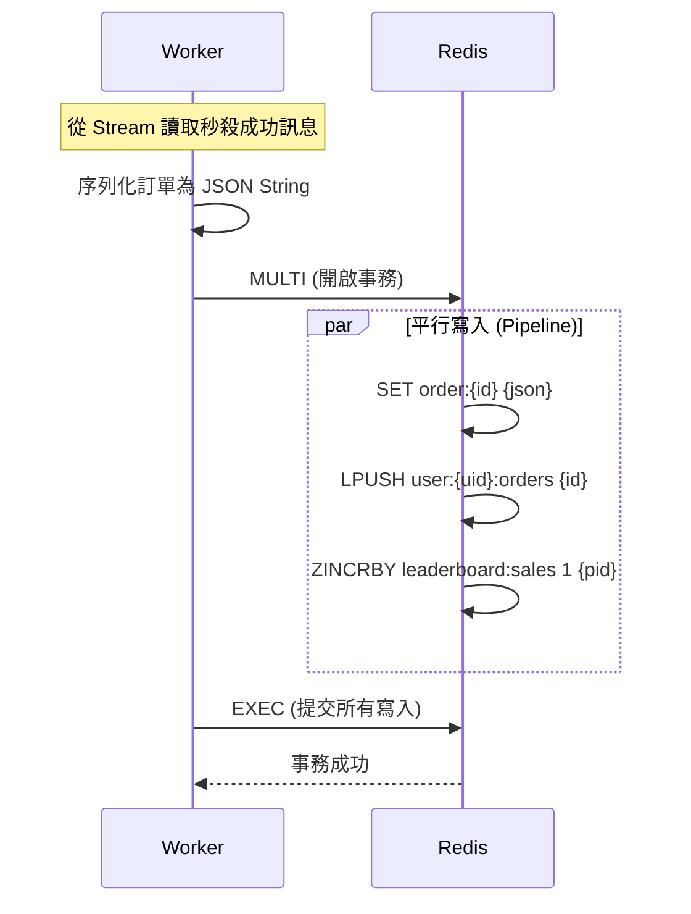

# Next.js 高併發秒殺系統

> 本專案展示使用 **Redis** 作為主要資料儲存層，實現高併發秒殺、資料持久化、後台管理系統 (CMS) 與即時排行榜等完整業務功能。

## 專案核心亮點 (Key Highlights)

### 1\. 架構設計

  * **JSON Document Store**: 訂單實體資料以 `JSON String` 格式儲存，利用 `MGET` 指令實現批次、O(1) 的極速讀取。
  * **Manual Indexing (手動索引)**: 透過維護 `ZSet` (Sorted Set) 與 `List` 等 Redis 集合，模擬 SQL 的索引行為，成功實現了複雜的後台分頁查詢與資料關聯檢索。
  * **持久性 (Persistence)**: 本專案使用 **Docker Redis** 搭配 **AOF (Append Only File)** 持久化策略，每秒同步一次寫入操作至磁碟，確保服務重啟後訂單記錄與庫存數據不丟失。資料儲存於本地 `redis-data/` 目錄。

### 2\. 高併發與原子性控制

  * **Lua Scripting**: 將「檢查庫存」、「原子扣減」邏輯封裝在單一 Lua 腳本中，在 Redis 伺服器端原子執行，從根本上杜絕超賣。
  * **Redis Streams**: 作為異步訊息隊列，用於緩衝秒殺瞬間的大量寫入請求，對突發流量進行削峰填谷 (Traffic Shaping)，保護下游 Worker。

### 3\. 完整業務功能實現

  * **Admin Dashboard**: 透過 `ZSet` 實現全域訂單的分頁瀏覽；支援訂單內容編輯 (JSON Override) 與多索引級聯刪除，以維持數據一致性。亦包含完整商品管理功能（新增、補貨、刪除）。
  * **即時排行榜**: 基於 `ZSet` 的天然排序功能，提供零延遲、高效率的實時熱銷商品排行榜。

## 系統架構與資料設計 (Architecture and Data Modeling)

### 資料結構與用途

| 功能 | Redis 結構 | Key Pattern | 設計邏輯 |
| :--- | :--- | :--- | :--- |
| **訂單實體** | `String` | `order:{id}` | 儲存 JSON 化的訂單內容 |
| **後台分頁** | `ZSet` | `orders:index` | Score=時間戳，用於管理員按時間倒序分頁 |
| **用戶歷史** | `List` | `user:{uid}:orders` | 儲存該用戶的訂單 ID 列表 |
| **熱銷排行** | `ZSet` | `leaderboard:sales` | Score=銷量，用於實時生成排行榜 |

### 資料流示意圖 (Worker 寫入)



## 快速開始 (Quick Start)

### 前置要求

- **Node.js** 18+ 與 **pnpm**
- **Docker** 與 **Docker Compose**（用於運行 Redis）

### 1. 啟動 Redis

使用 Docker Compose 啟動本地 Redis 實例：

```bash
pnpm docker:up
```

### 停止 Redis

```bash
pnpm docker:down
```

### 查看 Redis 日誌

```bash
pnpm docker:logs
```

### 連接 Redis CLI

```bash
docker exec -it redis-seckill redis-cli
```

### 數據備份

Redis 數據儲存於 `redis-data/` 目錄，可直接備份此目錄：

```bash
# 備份
cp -r redis-data/ redis-data-backup/

# 恢復（需先停止 Redis）
pnpm docker:down
cp -r redis-data-backup/ redis-data/
pnpm docker:up
```

## 尚待解決之問題

更值得探索的方向：Worker 失敗後的彌補機制 (Compensation)

必須建立一個明確的機制來處理 `Stream` 中永遠無法被 `XACK` 的訊息（即：DLQ/重試失敗）。

當訊息被確認為無法處理（例如：重試 N 次失敗）時，你需要執行補償事務 (Compensation Transaction)：

1. 將該訊息隔離到 DLQ。
2. 執行庫存回滾： 找出該訂單扣減的 productId，並對 `product:stock:{id}` 執行 `INCR` 操作，將庫存加回去。
3. 通知用戶（例如通過郵件或簡訊）：「由於系統錯誤，您的訂單被取消，庫存已釋放。」