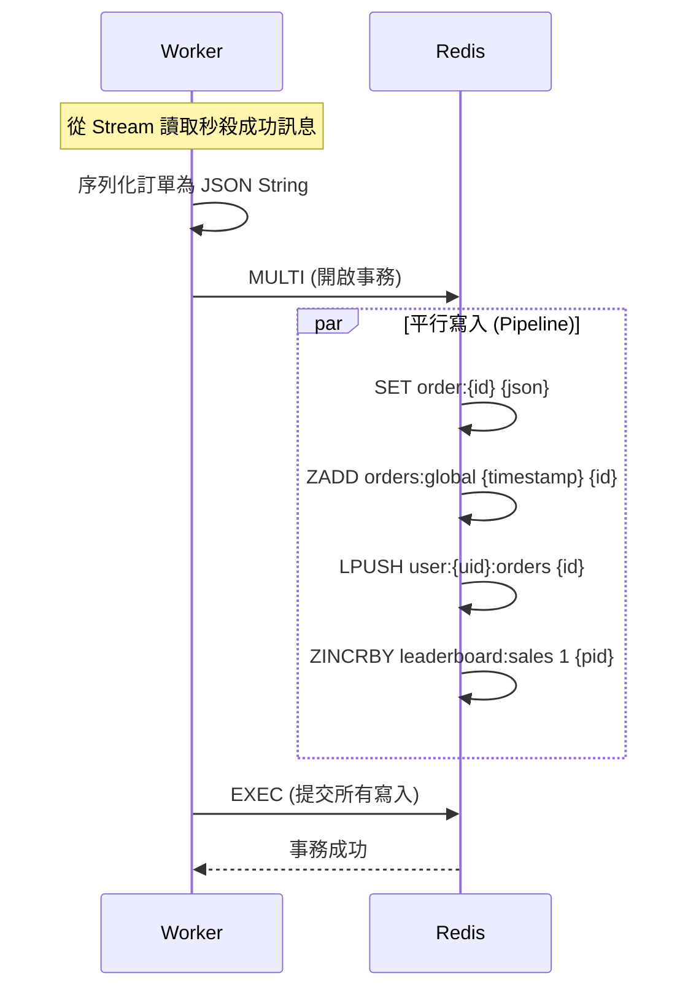

# Next.js 高併發秒殺系統

> 本專案展示使用 **Redis** 作為主要資料儲存層，實現高併發秒殺、資料持久化、後台管理系統 (CMS) 與即時排行榜等完整業務功能。

## 專案核心亮點 (Key Highlights)

### 1\. Redis-Only 極致架構 (No SQL)

  * **JSON Document Store**: 訂單實體資料以 `JSON String` 格式儲存，利用 `MGET` 指令實現批次、O(1) 的極速讀取。
  * **Manual Indexing (手動索引)**: 透過維護 `ZSet` (Sorted Set) 與 `List` 等 Redis 集合，模擬 SQL 的索引行為，成功實現了複雜的後台分頁查詢與資料關聯檢索。
  * **持久性 (Persistence)**: 強制啟用 **Redis AOF (Append Only File)** 機制，確保服務重啟後，所有訂單記錄與庫存數據不丟失。

### 2\. 高併發與原子性控制 (Concurrency Control)

  * **Lua Scripting**: 將「檢查庫存」、「原子扣減」與「防重複購買」邏輯封裝在單一 Lua 腳本中，在 Redis 伺服器端原子執行，從根本上杜絕超賣。
  * **Redis Streams**: 作為異步訊息隊列，用於緩衝秒殺瞬間的大量寫入請求，對突發流量進行削峰填谷 (Traffic Shaping)，保護下游 Worker。

### 3\. 完整業務功能實現

  * **Admin Dashboard**: 透過 `ZSet` 實現全域訂單的分頁瀏覽；支援訂單內容編輯 (JSON Override) 與多索引級聯刪除，以維持數據一致性。
  * **即時排行榜**: 基於 `ZSet` 的天然排序功能，提供零延遲、高效率的實時熱銷商品排行榜。

## 系統架構與資料設計 (Architecture and Data Modeling)

### 關鍵資料結構與用途

| 功能 | Redis 結構 | Key Pattern | 設計邏輯 |
| :--- | :--- | :--- | :--- |
| **訂單實體** | `String` | `order:{id}` | 儲存 JSON 化的訂單內容 |
| **後台分頁** | `ZSet` | `orders:global` | Score=時間戳，用於管理員按時間倒序分頁 |
| **用戶歷史** | `List` | `user:{uid}:orders` | 儲存該用戶的訂單 ID 列表 |
| **熱銷排行** | `ZSet` | `leaderboard:sales` | Score=銷量，用於實時生成排行榜 |

### 資料流示意圖 (Worker 寫入)



## 快速開始 (Quick Start)

### 1\. 啟動環境 (使用 Docker Compose)

確保已安裝 Docker 與 Docker Compose。

```bash
# 啟動 Redis 容器 (配置已包含 AOF 啟用)
docker-compose up -d
```

### 2\. 安裝依賴 (使用 pnpm)

本專案使用 pnpm 作為套件管理器。

```bash
pnpm install
```

### 3\. 啟動後端 Worker (Stream Consumer)

Worker 負責處理 Stream 訊息並將資料寫入多個 Redis Key 以維護索引。

```bash
pnpm run worker
```

### 4\. 啟動 Next.js 應用 (Frontend & API)

```bash
pnpm run dev
```

  * **前台搶購頁面**: [http://localhost:3000](https://www.google.com/search?q=http://localhost:3000)
  * **後台管理系統**: [http://localhost:3000/admin](https://www.google.com/search?q=http://localhost:3000/admin)

## 壓力測試與驗證 (Testing)

以 `k6` 進行壓力測試，驗證系統在高併發下的穩定性與資料一致性。

```bash
# 針對本機進行測試
k6 run scripts/load-test.js

# 針對已部署的 URL 進行測試
BASE_URL=https://your-app.vercel.app k6 run scripts/load-test.js
```

**驗證重點：** 確保在任何情況下，庫存數量準確，且 `orders:global` (後台列表) 總數與 `leaderboard:sales` (排行榜) 總分必須相等。