## 1\. 專案概述 (Project Overview)

### 1.1 核心目標

構建一個具備高併發處理能力的電商秒殺系統，實現完整的業務功能（包含後台管理與報表）。

### 1.2 技術架構原則

  - **Persistence Strategy**: 強制啟用 **Redis AOF (Append Only File)**，策略設為 `appendfsync everysec`，確保資料持久性。
  - **Data Modeling**: 採用 **JSON String Store** 搭配 **Manual Indexing** (手動維護索引) 策略。
  - **Concurrency Control**: 核心庫存扣減依賴 **Lua Script**，寫入壓力透過 **Redis Streams** 異步緩衝。

-----

## 2\. 資料結構設計 (Data Schema)

### 2.1 實體資料 (Entities) - 儲存實際內容

| Key Pattern | Type | 用途 | 內容範例 (JSON / Value) |
| :--- | :--- | :--- | :--- |
| `order:{orderId}` | **String** | **訂單主體** (不可變) | `{"id":"o101", "uid":"u1", "pid":"p1", "price":999, "ts":17100000}` |
| `product:stock:{id}` | String | 庫存計數器 | `50` (整數) |
| `product:info:{id}` | Hash | 商品靜態資訊 | `{"name": "iPhone 15", "img": "url..."}` |

### 2.2 索引資料 (Indexes) - 支援查詢與關聯

為了支援後台分頁 (Pagination) 與特定查詢，需在寫入時同步維護以下集合：

| Key Pattern | Type | 用途 | 結構邏輯 |
| :--- | :--- | :--- | :--- |
| `orders:global` | **ZSet** | **全域訂單索引** (Admin 分頁用) | **Member**: `orderId` **Score**: `Timestamp` (下單時間戳) |
| `user:{uid}:orders` | List | 用戶歷史訂單 | 存放 `orderId` 的列表 (LPUSH/LRANGE) |
| `leaderboard:sales` | **ZSet** | **熱銷排行榜** | **Member**: `productId` **Score**: `SalesCount` (銷量) |
| `seckill:users:{pid}`| Set | 防重複購買名單 | Member: `userId` |

-----

## 3\. 業務邏輯詳解 (Detailed Logic)

### 3.1 核心秒殺流程 (Seckill Flow) - Hot Path

  * **觸發點**: `POST /api/seckill`
  * **同步處理 (Redis Lua)**:
    1.  檢查 `seckill:users:{pid}` 是否包含 `userId` (防重複)。
    2.  檢查 `product:stock:{id}` 是否 \> 0。
    3.  執行 `DECR` 扣庫存。
    4.  執行 `SADD` 寫入購買名單。
    5.  執行 `XADD` 將請求推入 Stream `orders:stream`。
  * **回傳**: 若成功，回傳 HTTP 200 與臨時 OrderID；失敗回傳 HTTP 409 (Sold Out)。

### 3.2 異步寫入與索引維護 (Worker Flow) - Persistence

Worker 消費 Stream 訊息，將資料「實體化」並建立索引。此步驟必須具備**原子性**。

  * **觸發點**: Worker `XREADGROUP`
  * **處理邏輯 (Pipeline Transaction)**:
    1.  準備訂單物件並 `JSON.stringify`。
    2.  開啟 `MULTI` (Transaction)。
    3.  **寫入實體**: `SET order:{id} {json}`。
    4.  **寫入用戶索引**: `LPUSH user:{uid}:orders {id}`。
    5.  **寫入全域索引**: `ZADD orders:global {timestamp} {id}` (關鍵：供 Admin 分頁)。
    6.  **更新排行榜**: `ZINCRBY leaderboard:sales 1 {pid}`。
    7.  執行 `EXEC`。
    8.  `XACK` 確認訊息處理完畢。

### 3.3 後台管理功能 (Admin Dashboard)

  * **訂單列表 (Pagination)**:
      * 利用 `ZSet` 的排序特性實現分頁。
      * **Step 1**: `ZREVRANGE orders:global {start} {end}` 取得當前頁面的 10 個 `orderId`。
      * **Step 2**: `MGET order:{id1} order:{id2} ...` 一次性拉取所有 JSON 資料。
      * **優勢**: 避免了 `KEYS *` 的全表掃描效能問題。
  * **編輯訂單 (Edit)**:
      * 讀取 JSON -\> 解析 -\> 修改 -\> `JSON.stringify` -\> `SET` 覆蓋原 Key。
  * **刪除訂單 (Delete)**:
      * **挑戰**: 需避免索引殘留 (Dangling References)。
      * **邏輯**: 使用 `MULTI` 同時刪除：
        1.  `DEL order:{id}` (實體)
        2.  `ZREM orders:global {id}` (全域索引)
        3.  `LREM user:{uid}:orders 0 {id}` (用戶索引)
    
    * **商品管理 (Product Management)**:
        * **新增商品 (Create)**: 
            * `JSON.SET product:{id} $ {json}` (商品資訊)
            * `SET product:stock:{id} {stock}` (初始庫存)
        * **補貨 (Restock)**:
            * `INCRBY product:stock:{id} {amount}` (原子增加庫存)
        * **刪除商品 (Delete)**:
            * `DEL product:{id}`
            * `DEL product:stock:{id}`

### 3.4 排行榜 (Leaderboard)

  * **邏輯**: 直接讀取 `leaderboard:sales`。
  * **查詢**: `ZREVRANGE leaderboard:sales 0 9 WITHSCORES` (取前 10 名含銷量)。

-----

## 4\. 系統循序圖 (Sequence Diagram)

### Worker 寫入事務圖

展示 Worker 如何同時處理資料儲存與索引建立。

```mermaid
sequenceDiagram
    participant Worker
    participant Redis

    Note over Worker: 1. 解析 Stream 訊息
    Worker->>Worker: 構建 JSON String
    
    Note over Worker: 2. 準備 Pipeline
    Worker->>Redis: MULTI
    
    rect rgb(45, 45, 45)
        Note right of Redis: 寫入實體數據
        Redis->>Redis: SET order:101 "{\"id\":\"101\", \"amt\":999...}"
        
        Note right of Redis: 建立查詢索引
        Redis->>Redis: LPUSH user:Alice:orders "101"
        Redis->>Redis: ZADD orders:global 1716537600 "101"
        
        Note right of Redis: 更新業務統計
        Redis->>Redis: ZINCRBY leaderboard:sales 1 "item_A"
    end
    
    Worker->>Redis: EXEC
    Redis-->>Worker: OK (Transaction Committed)
    
    Worker->>Redis: XACK orders:stream group1 msg_id
```

-----

## 5\. API 介面規範 (Internal API Specification)

| 方法 | 路徑 | 描述 | Redis 關鍵指令 |
| :--- | :--- | :--- | :--- |
| **POST** | `/api/seckill` | 用戶搶購 | `EVALSHA` |
| **GET** | `/api/orders` | 用戶歷史訂單 | `LRANGE` + `MGET` |
| **GET** | `/api/admin/orders` | **後台訂單列表** (分頁) | `ZREVRANGE` + `MGET` |
| **PUT** | `/api/admin/orders` | **後台編輯訂單** | `SET` (Overwrite JSON) |
| **DELETE** | `/api/admin/orders` | **後台刪除訂單** | `DEL`, `ZREM`, `LREM` (Transaction) |
| **GET** | `/api/products` | 商品列表 | `JSON.GET` / `SCAN` |
| **POST** | `/api/seed` | 初始化數據 | `JSON.SET`, `SET` (Pipeline) |
| **POST** | `/api/admin/products/create` | **後台新增商品** | `JSON.SET`, `SET` |
| **POST** | `/api/admin/products/restock` | **後台商品補貨** | `INCRBY` |
| **POST** | `/api/admin/products/delete` | **後台刪除商品** | `DEL` |

-----

## 6\. 非功能性需求 (Non-Functional Requirements)

1.  **資料一致性**: 使用 Redis Transaction (`MULTI`/`EXEC`) 確保「訂單本體」與「索引」的狀態一致。
2.  **持久化**: 依賴 AOF 機制，容忍最多 1 秒的數據丟失 (Everysec policy)，但在重啟後索引與數據必須吻合。
3.  **效能目標**:
      * 秒殺介面回應時間 \< 50ms。
      * 後台列表查詢時間 \< 20ms (利用 MGET)。